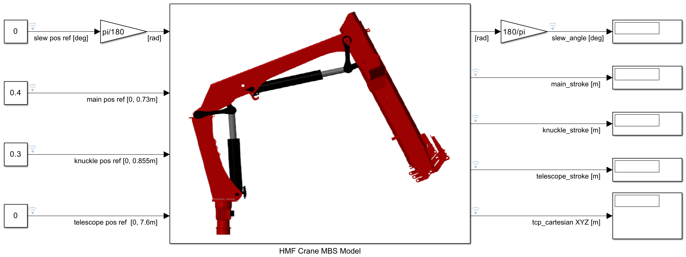

# HMF Crane MBS Simulink Simulink

This repo includes the MATLAB-Simulink MBS Simulator model of the HMF Crane located in the Norwegian Motion Laboratory ([UiA Motion Lab](https://www.uia.no/motionlab)).

 

The Simulator is currently a work in progress and was initially developed during the Mechatronics MSc thesis "Demonstrating Autonomous Hooking System for Cranes: Development of Embedded Perception and Control System" at the University of Agder by Lars Østerholt and Sindre Olsen in 2025 using MATLAB R2024b together with Simulink, and Simscape Multibody.

Open the HMFCraneMbsModel.slx file to start the Simulator.

 